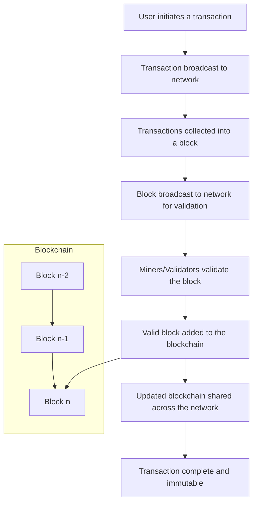

# Blocker - adventures in Blockchain

Blockchain is a decentralized and distributed ledger technology that records transactions securely across multiple computers, ensuring transparency and immutability. Each block contains a set of transactions linked cryptographically to the previous block, forming a secure and tamper-proof chain

## Installation

Use the package manager [pip](https://pip.pypa.io/en/stable/) to install the required packages.

```bash
pip install -r requirements.txt
```

## Usage

### Setup
```python
chmod +x app.py
```

```python
./app.py
```

The blockchain and the blockchain API interface is now up and running.

### Control
Use, for instance, curl to call the API.

```bash
curl -H 'Content-Type: application/json' \
      -d '{}' \
      -X GET \
      http://127.0.0.1:5000/get_chain
```

### Documentation
To access Swagger (OpenAPI) docs fire up your favorite browser and point it to 
http://127.0.0.1:5050/openapi/swagger


## Logic
This is how it conceptually works. From initiating a transaction to it becoming a permanent part of the blockchain ledger.



## Contributing

Pull requests are welcome. For major changes, please open an issue first
to discuss what you would like to change.

Please make sure to update tests as appropriate.

## License

[MIT](https://choosealicense.com/licenses/mit/)
